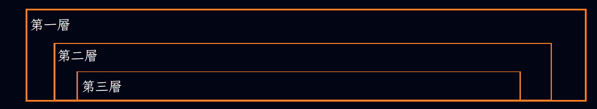
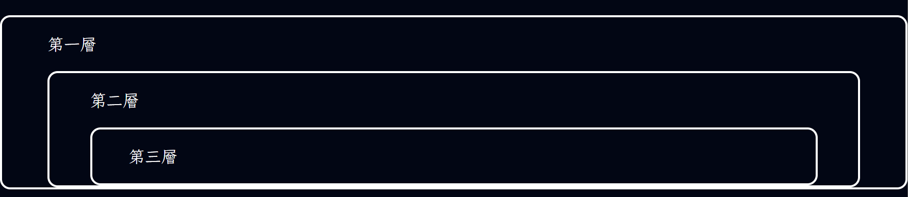

<!-- 
      ╔════╦════╗       ╔╗       ╔══╗       ╔══════
      ║    ║    ║      ╔╝╚╗      ║    ╚═╗   ║
      ║    ║    ║      ║  ║      ║       ║  ╠══════
      ║    ║    ║    ╔╝    ╚╗    ║       ║  ║
      ║    ║    ║    ╠══════╣    ║    ╔═╝   ║
      ║    ║    ║  ╔╝        ╚╗  ╚══╝       ╚══════


                      ╔═════╗   ║       ║
                      ║     ║    ╚╗   ╔╝
                      ║═════╣      ╚╦╝
                      ║     ║       ║
                      ║     ║       ║
                      ╚═════╝       ║


      ╔══  ║     ║  ╔══  ║    ║        ═╦═  ╔══╗  ╔═══
      ║     ║   ║   ║    ║    ║         ║   ║  ║  ║
      ║      ╚╦╝    ╚═╗  ╠════╣         ║   ╠╦═╝  ║
      ║       ║       ║  ║    ║         ║   ║╚═╗  ║
      ╚══     ║     ══╝  ║    ║        ═╩═  ║  ╚  ╚═══

                    資研社保佑   程式bug退散
-->

<!--來自資研社 請求佛祖保佑
  
                       _oo0oo_
                      o8888888o
                      88" . "88
                      (| -_- |)
                      0\  =  /0
                    ___/`---'\___
                  .' \\|     |// '.
                 / \\|||  :  |||// \
                / _||||| -:- |||||- \
               |   | \\\  -  /// |   |
               | \_|  ''\---/''  |_/ |
               \  .-\__  '-'  ___/-. /
             ___'. .'  /--.--\  `. .'___
          ."" '<  `.___\_<|>_/___.' >' "".
         | | :  `- \`.;`\ _ /`;.`/ - ` : | |
         \  \ `_.   \_ __\ /__ _/   .-` /  /
     =====`-.____`.___ \_____/___.-`___.-'=====
                       `=---='


     ~~~~~~~~~~~~~~~~~~~~~~~~~~~~~~~~~~~~~~~~~~~

               佛祖保佑         永無BUG
-->

# 嘉義高中資訊研究社網站模板

這是嘉義高中資訊研究社的網站模板，我們會在之後說明如何使用。

# 範本結構
```txt
範本
    -index.html
    -style.css
    -popup.js
```
## index.html
主要網站的編寫範本與教學。

在此範本中這個檔案只有可用到的class與head教學。

## style.css
css的模型，是整個網站的精隨所在。

## popup.js
若要使用popup (正式名稱:modal) 才需要的一個 Javascript。

# 基本資訊
- 背景顏色 = #020614
- 文字顏色 = white (#fff、#ffffff)
- 連結顏色 = cyan (#00ffff)

# 使用說明
## 你必須先知道
我們每個檔案都要有護身符，若沒有護身符，則就不符合我們的範本。
## 護身符
以註解的形式存在所有可註解的程式檔案，分為兩個部分。
### 資研社保佑
這個部份不可更改，因為我們會保佑使用這個範本的程式。
```txt
      ╔════╦════╗       ╔╗       ╔══╗       ╔══════
      ║    ║    ║      ╔╝╚╗      ║    ╚═╗   ║
      ║    ║    ║      ║  ║      ║       ║  ╠══════
      ║    ║    ║    ╔╝    ╚╗    ║       ║  ║
      ║    ║    ║    ╠══════╣    ║    ╔═╝   ║
      ║    ║    ║  ╔╝        ╚╗  ╚══╝       ╚══════


                      ╔═════╗   ║       ║
                      ║     ║    ╚╗   ╔╝
                      ║═════╣      ╚╦╝
                      ║     ║       ║
                      ║     ║       ║
                      ╚═════╝       ║


      ╔══  ║     ║  ╔══  ║    ║        ═╦═  ╔══╗  ╔═══
      ║     ║   ║   ║    ║    ║         ║   ║  ║  ║
      ║      ╚╦╝    ╚═╗  ╠════╣         ║   ╠╦═╝  ║
      ║       ║       ║  ║    ║         ║   ║╚═╗  ║
      ╚══     ║     ══╝  ║    ║        ═╩═  ║  ╚  ╚═══

                    資研社保佑   程式bug退散
```
### 佛祖保佑
這裡可以根據個人需求更動、刪除。(雖然我們不信佛教)
```txt
來自xxx 請求佛祖保佑
  
                       _oo0oo_
                      o8888888o
                      88" . "88
                      (| -_- |)
                      0\  =  /0
                    ___/`---'\___
                  .' \\|     |// '.
                 / \\|||  :  |||// \
                / _||||| -:- |||||- \
               |   | \\\  -  /// |   |
               | \_|  ''\---/''  |_/ |
               \  .-\__  '-'  ___/-. /
             ___'. .'  /--.--\  `. .'___
          ."" '<  `.___\_<|>_/___.' >' "".
         | | :  `- \`.;`\ _ /`;.`/ - ` : | |
         \  \ `_.   \_ __\ /__ _/   .-` /  /
     =====`-.____`.___ \_____/___.-`___.-'=====
                       `=---='


     ~~~~~~~~~~~~~~~~~~~~~~~~~~~~~~~~~~~~~~~~~~~

               佛祖保佑         永無BUG
```
### 其他保佑
你可以自己加上自己的護身符，記得最後要加一行「保佑詞」。

## HTML
這個部分，我們會介紹HTML的架構
### head
```html
<head>
    <meta charset="UTF-8">
    <meta name="viewport" content="width=device-width, initial-scale=1.0">
    <!-- 連結預覽 -->
    <meta name="description"
        content="網站說明">
    <meta name="keywords"
        content="關鍵字">
    <link rel="canonical" href="主要連結">
    <meta name="twitter:card" content="summary_large_image"> <!-- 暫不更動 -->
    <meta name="twitter:image:src" content="預覽圖片">
    <meta name="twitter:label1" content="預估閱讀時間">
    <meta name="twitter:data1" content="2 分鐘">
    <meta property="og:site_name" content="網站名稱">
    <meta property="og:type" content="website"> <!-- 暫不更動 -->
    <meta property="og:title" content="網站名稱">
    <meta property="og:description"
        content="網站說明">
    <meta property="og:image" content="預覽圖片">
    <meta property="og:url" content="連結">
    <!-- 網站顯示資料 -->
    <title>網站名稱</title>
    <link rel="stylesheet" href="./style.css">
    <!-- 字體 -->
    <link rel="preconnect" href="https://fonts.googleapis.com">
    <link rel="preconnect" href="https://fonts.gstatic.com" crossorigin>
    <link href="https://fonts.googleapis.com/css2?family=LXGW+WenKai+TC:wght@300;400;700&display=swap" rel="stylesheet">
    <!-- JQuery -->
    <script src="https://ajax.googleapis.com/ajax/libs/jquery/1.7.1/jquery.min.js" type="text/javascript"></script>
    <!-- Icons -->
    <script src="https://kit.fontawesome.com/a80c5dc208.js" crossorigin="anonymous"></script>
    <!-- 需要使用Popup時請解開註解(VSCode: Ctrl+K -> Ctrl+U) -->
    <!-- <script src="./popup.js"></script> -->
</head>
```
### 逐行解釋
#### 基本設定、Google搜尋標籤
確認編碼
```html
<meta charset="UTF-8">
```
顯示設定
```html
<meta name="viewport" content="width=device-width, initial-scale=1.0">
```
網站說明
```html
<meta name="description"
        content="網站說明">
```
網站關鍵字(Google已經不用了，但其他網站可能會用)
```html
<meta name="keywords"
        content="關鍵字">
```
這個網站的主要連結(絕對連結)
```html
<link rel="canonical" href="主要連結">
```
#### X(twitter)用的連結預覽
卡片設定
```html
<meta name="twitter:card" 
content="summary_large_image"> <!-- 暫不更動 -->
```
預覽圖片
```html
<meta name="twitter:image:src" content="預覽圖片">
```
預覽說明
```html
<meta name="twitter:label1" content="預估閱讀時間">
<meta name="twitter:data1" content="2 分鐘">
```
#### 其他網站的連結預覽
名稱
```html
<meta property="og:site_name" content="網站名稱">
```
網站類型(可不更動)
```html
<meta property="og:type" content="website">
```
名稱
```html
<meta property="og:title" content="網站名稱">
```
說明
```html
<meta property="og:description"
content="網站說明">
```
預覽圖片
```html
<meta property="og:image" content="預覽圖片">
```
網站的連結(絕對連結)
```html
<meta property="og:url" content="連結">
```
#### 網站Client顯示
標題
```html
<title>網站名稱</title>
```
連結我們的CSS
```html
<link rel="stylesheet" href="./style.css">
```
連結字體
```html
<link rel="preconnect" href="https://fonts.googleapis.com">
<link rel="preconnect" href="https://fonts.gstatic.com" crossorigin>
<link href="https://fonts.googleapis.com/css2?family=LXGW+WenKai+TC:wght@300;400;700&display=swap" rel="stylesheet">
```
連結JQuery
```html
<script src="https://ajax.googleapis.com/ajax/libs/jquery/1.7.1/jquery.min.js" type="text/javascript"></script>
```
連結Icons
```html
<script src="https://kit.fontawesome.com/a80c5dc208.js" crossorigin="anonymous"></script>
```

### body
### class 介紹
#### top
封面圖片，**會隨著畫面大小變動**，電腦版請編輯[電腦版](./style.css#L227)，手機板請編輯[手機板](./style.css#L277)。

自帶動畫，預設為霓虹燈閃爍，若要更換請編輯[動畫](./style.css#L360)。


#### bg
背景圖片，**會隨著畫面大小變動**，電腦版請編輯[電腦版](./style.css#L197)，手機板請編輯[手機板](./style.css#L247)。

自帶動畫，預設為等待後淡入+無限循環霓虹燈效果，若要更換請編輯[淡入](./style.css#L408)、[霓虹燈](./style.css#L422)。

自帶模糊(8px)，若要更換電腦版請編輯[電腦版(兩行)](./style.css#L198)，手機板請編輯[手機板(兩行)](./style.css#L248)。


#### content
在網站上放**內容**時使用的標籤，有[自動縮排(5%)](./style.css#L62)，並且每層都會縮。


^*橘色框是後製上去的，原本沒有*

#### plate
用於需要**邊框**的內容，同樣有[自動縮排(5%)](./style.css#L69)，並且每層都會縮。



#### button
按鈕，滑鼠放上去會變色。變色的顏色可以在[這裡](./style.css#L101)設定。

自帶全螢幕伸展。

自帶轉場，時間請在[這裡](./style.css#L96)設定。


```html
<div class="button" onclick="">
        <p>這是按鈕</p>
</div>
```


#### tile
有時候你只想要簡單的單行列表完素，這就是你要的。
```html
<div class="plate">
    <div class="tile">
        <i class="你的icon"></i>
        <p>資訊1</p>
        <p>&nbsp;資訊2</p>
    </div>
</div>
```


#### no-change
有些連結你不想一開始就變色，用這個可以讓連結在hover的時候才變色。顏色可以在[這裡](./style.css#L106)設定。


### 其他元件介紹
#### Scroll Down
叫別人往下滑。可以將`<i>`中的class改成你要的Icon class。

自帶動畫，若要編輯請編輯[持續時間](./style.css#L315)、[動畫](./style.css#L342)。

自帶置中。若要編輯請編輯[這個class](./style.css#L297)。
```html
<a href="#你要跳到的id">
    <div class="sd">
        <p class="sd_icon"><i class="fa fa-angle-double-down"></i></p>
        <p>向下滑看更多</p>
    </div>
</a>
```
#### 連結自己的標題
記得`<a>`裡面的連結要是`#`加上標題的id。
```html
<a href="#your_id" class="no-change">
    <h1 class="lxgw-wenkai-tc-bold" id="your_id">標題</h1>
</a>
```

#### Popup (Modal)
跳出來的東西。

class要改成你想要的名字、解開[這個註解](./style.css#L145)，並複製一份[popup專用style](./style.css#L167) (記得要讓它是正式程式碼，不是註解)，複製後記得將`popup`改成你的class名字 (`popup`、`popup-content`的popup都要改掉)。
```html
<div class="名字" id="id" onclick="hide_form();">
    <span class="close" onclick="hide_form();">&times;</span>
    <div class="名字-content">
            
    </div>
</div>
```
範例

HTML
```html
<div class="pop" id="id" onclick="hide_form();">
    <span class="close" onclick="hide_form();">&times;</span>
    <div class="pop-content">
            
    </div>
</div>
```
CSS
```css
.close {
    color: #aaa;
    position: fixed;
    right: 1%;
    top: 1%;
    font-size: 50px;
    font-weight: bold;
    transition: 0.3s;
    z-index: 100;
}

.close:hover,
.close:focus {
    color: red;
    text-decoration: none;
    cursor: pointer;
    transform: scale(1.2, 1.2);
}  

.pop { 
    display: none;
    position: fixed;
    top: 0;
    width: 100%;
    height: 100%;
    background-color: rgba(0, 0, 0, 0.7);
    z-index: 100;
}

.pop-content {
    border: 2px solid white;
    border-radius: 10px;
    width: 85%;
    height: 95%;
    margin: auto;
    padding: 0;
    position: relative;
    background-color: #020614;
} 
```

## CSS
其實也沒什麼好講的。

### 特殊設定
#### 隱藏Scroll Bar
在[第53行](./style.css#L53)有相關設定。

#### 平滑捲動
在[第48行](./style.css#L48)有相關設定。

## Js

### 解釋
需要popup (modal) 的時候才用。

名字自己取，大致上就是顯示跟隱藏。

`fadeIn()`、`fadeOut()`似乎是JQuery專用的。

`$()`是JQuery的標記，`#`代表id，`.`代表class。
```js
function show_名字() {
    $("#id.class").fadeIn('fast');
}

function hide_名字() {
    $("#id.class").fadeOut('fast');
}
```

# 恭喜你讀完了，希望你有掌握這個模板的技巧 !
